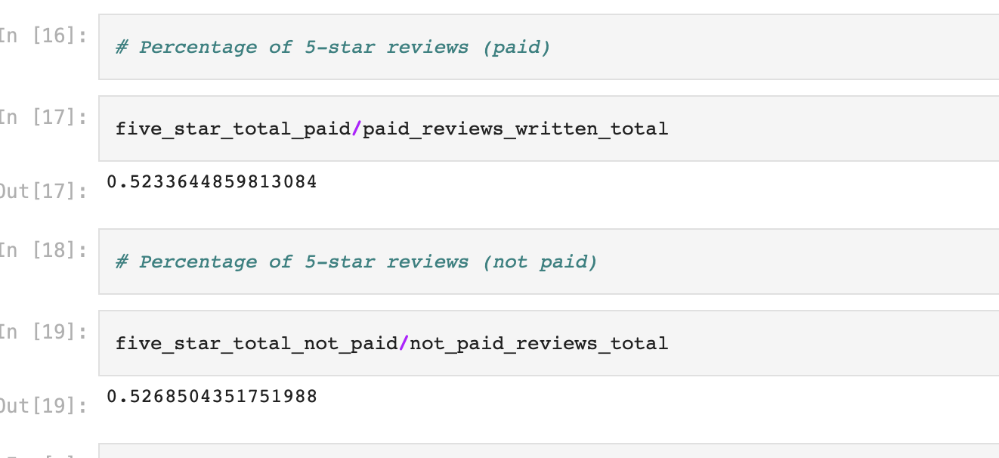

# Amazon Vine Review Analysis

## Overview

The purpose of this analysis is to determine whether Vine reviews are higher than non-Vine reviews, and whether the expense of paying reviewers is justified.

The dataset included *Outdoors* products reviewed in the United States.

## Results: 

	- There were 107 Vine reviews and 39869 non-Vine reviews.
	- 56 Vine reviews were 5 stars
	- 21,005 non-Vine reviews were 5 stars
	- 52% of Vine reviews were 5 stars
	- 53% of non-Vine reviews were 5 stars

## Summary: 
There is not a positivity bias for reviews in the Vine program; in fact, the data shows that both paid and unpaid reviewers score 5-star at about the same rate - 52%(paid) to 53%(unpaid).

### One additional analysis:
Compare 4-star review data to 5-star review data.